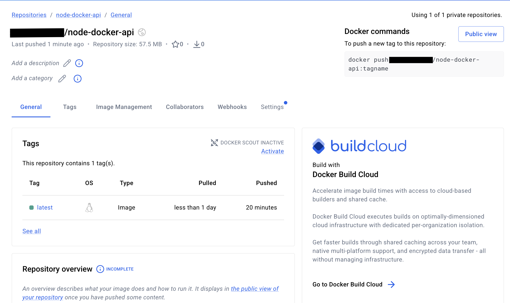

##  **Deploying a Node.js Application with Docker**
  
  
### **What is docker and why containerization?**
  
After building a Node.js application, running it locally on your machine is easy and simple.But, if another person run the same application on their computer it may not work because the required environment including the dependencies may not exist/installed on their machine.The solution to this is containerization.Containerizing an application means bundling the application code,dependencies, libraries and configuration files into a single, lightweight image which will run in any machine or cloud environmet.One of the most used tools for this process is Docker.
  
Now on, we will walkthrough how to containerize a node.js application and deploy it to the cloud.
  
### **Table of contents -**
  
1.Prerequisites\
2.Setting up a Node.js app\
3.Writing the Dockerfile\
4.Building and testing the container\
5.Preparing for deployment\
6.Deploying to the cloud
  
  
### **1. Prerequisites**
  
First, you should have set up the following in your system.
  
- #### Node.js and npm
  
you should have installed Node.js (v18 and higher) ([https://nodejs.org/en/download)](url ) and npm in your system because before containerizing you can check whether the application runs properly in the local system.
  
To check the versions;
  
> node -v\
> npm -v
  
- #### Docker installed and running
  
Docker is the main tool we will use for containerizing.You should ensure that Docker desktop or Docker engine is installed depending on your system and it is in the running mode.You can confirm it by the following command.
  
> docker --version
  
- #### Docker hub account (or any container registry)
  
You will need a docker hub account to push your container image to the cloud. This will allow the deployment platform to pull and run the image.You can create an account through [https://hub.docker.com](url )
  
- #### Create a project structure like this in your preferred IDE (IntelliJ,VS code etc.)
  
```
node-docker-api/
│
├── app.js
├── package.json
├── Dockerfile
├── .dockerignore
└── .env 
```
  
- #### A cloud platform account setup
  
In this tutorial, AWS is used as the cloud platform and the application is deployed to the cloud using AWS EC2 instances. But, you can use other cloud platforms such as AZURE, GCP as well.
You have to create an AWS or any cloud platform account to follow this tutorial.
  
### **2. Setting up a Node.js app**
  
Let's build a simple Node.js REST API. This example uses Node.js with Express.
  
1. Change the directory to the project folder
  
> cd node-docker-api
  
2. Initialize the project:
  
>  npm init -y
  
3. Create the API File
  
Edit **app.js** file.
  
```
const express = require("express");
const app = express();
  
app.get("/", (req, res) => {
  res.send("Node.js Docker API is running");
});
  
app.get("/health", (req, res) => {
  res.json({ status: "OK" });
});
  
app.listen(3000, () => {
  console.log("Server running on port 3000");
});
  
```
4. Update .env file 
  
`PORT=3000`
  
5. Update package.json file
  
Add a start script.
  
>{
  "name": "node-docker-api",
  "version": "1.0.0",
  "main": "app.js",
  "scripts": {
    "start": "node app.js"
  },
  "dependencies": {
    "express": "^5.1.0",
    "dotenv": "^16.4.5"
  }
}
  
  
6. Update .dockerignore file
  
  
>node_modules
npm-debug.log
.git
.gitignore
.env
  
  
  
7. Run the API locally
  
Start the server.
  
> npm start
  
Server runs on:
  
[http://localhost:3000](url )
  
8. Test the API
  
Health check - 
  
> GET /health
  
Example:
  
> http://localhost:3000/health
  
Response:
  
> {\
> "status": "OK"\
> }
  
### **3. Creating the Dockerfile**
  
To run this file in a container you should write a Dockerfile which defines how to build the container image.
  
Create a new file called **Dockerfile** and add the below content;
  
```
FROM node:24-alpine
  
WORKDIR /app
  
COPY package*.json ./
  
RUN npm install
  
COPY . .
  
EXPOSE 3000
  
CMD ["npm", "start"]
  
```
  
##### **node:24-alpine**
  
The Node.js version required to run the application. Instead of a full Linux system, alpine uses a minimal environment, making the container much smaller.
  
##### **WORKDIR /app**
  
Sets the working directory(/app) inside the container.
  
##### **COPY package*json ./**
  
This copies dependency definition files from the host machine to the container.The files are copied into the current working directory (/app).
  
##### **RUN npm install**
  
This command installs the dependencies defined in package.json.
  
##### **COPY . .**
  
Copies the remaining application files from the host machine into the container.
  
Examples of copied files:
  
- app.js
  
- configuration files
  
- source code
  
The files are copied into the /app directory.
  
##### **EXPOSE 3000**
  
This instruction documents that the container listens on port 3000.
  
It does not publish the port automatically but indicates that the application inside the container uses this port.
  
##### **CMD ["npm", "start"]**
  
Defines the default command executed when the container starts.
  
> npm start
  
Executes the start script defined in package.json, which typically starts the Node.js server.
  
  
### **4.Building and testing the container**
  
  
Build the image;
  
> docker build -t node-api .
  
Run the container;
  
> docker run -p 3000:3000 node-api
  
  
Now, open [http://localhost:3000](url ) in your browser, and you should see the JSON message {"Node.js Docker API is running"}. 
  
At this point, your app works in a container.
  
  
### **5. Preparing for deployment**
  
To deploy your application to the cloud, you should push your image to a container registry like Docker hub. Then, your cloud provider can pull the image for deployment.
  
Tag your image with a registry path.
  
Ex:
> docker tag node-api your-dockerhub-username/node-docker-api:latest
  
Then log in and push the image.
  
> docker login\
> docker push your-dockerhub-username/node-docker-api:latest
  
You can check the image in your cloud registry now.
  

  
  
  
  
### **6. Deploying to the cloud**
  
  
#### Step 1: Creating an EC2 instance
  
Go to AWS console and type EC2 in the search bar and select the service.
Click launch instance.
1. Give a name to the instance
2. Select an Amazon Machine Image (AMI)\
Choose an Amazon Linux AMI with pre-installed configurations for the operating system, application server, and applications needed to be deployed.
  
3. Select an instance type like t2.micro which is suitable for small-scale deployments.
4. Set up a key pair\
Generate and download a key pair to SSH into your instance.Store the downloaded key in a secure location.
5. Configure Security group\
Configure your security group to control the inbound and outbound traffic for the instance. In this case, create rules to allow HTTP(80) and HTTPS(443) traffic.
6. Click Launch instance button.
  
  
#### Step 2: Docker installation on EC2 instance
  
1. Go to the details of the EC2 instance and copy the public ip.
  
2. SSH into the instance using;
  
> ssh -i [Path-to-key-pair-file] ec2-user@[server-public-ip]
  
NOTE: If you get a bad permission error, type this in the terminal to change the permission levels of the key pair.
  
> chmod 400 "[Path-to-key-pair-file]]"
  
3. Install docker and start the service
  
> sudo yum install -y docker
> sudo service docker start
  
4. Verify installation
  
> sudo service docker status
  
#### Step 3: Execute the docker image
  
1. Run the docker image.
  
> `docker run -d -p 80:3000 your-dockerhub-username/node-docker-api:latest`
  
The -p 80:3000 flag maps port 3000 on the container to port 80 on the EC2 instance.
  
2. Test the deployment.
  
Open a browser tab, enter the public ip address of the EC2 instance and check whether the message "Node.js Docker API is running" is displayed on the browser page.
  
You have deployed a Node.js application on an AWS EC2 instance using Docker.This simple application process is the base for more-complicated, large-scale deployments.
  
  
  
  
  
  
  
  
  
  
  
  
  
  
  
  
  
  
  
  
  
  
  
  
  
  
  
  
  
  
  
  
  
  
  
  