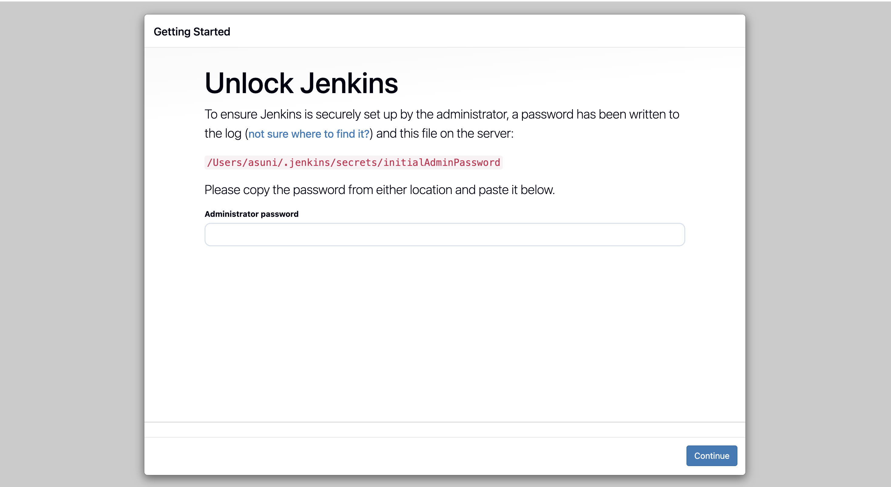
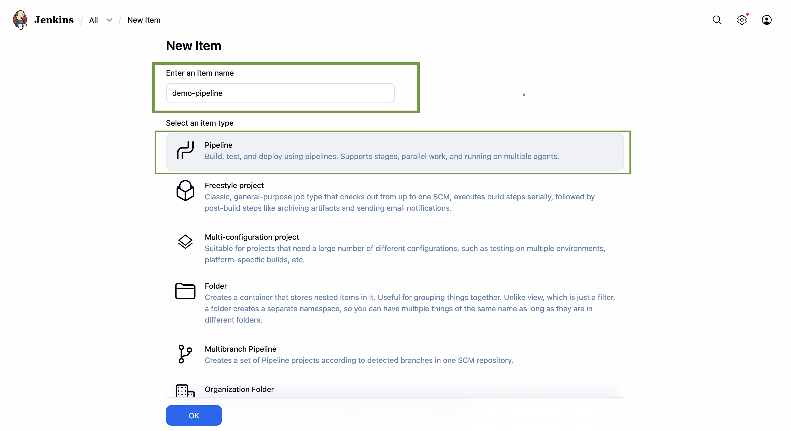

# 🚀 DevOps Technical Documentation Portfolio

This repository contains sample technical documentation created to demonstrate my ability to write clear, structured, and practical guides for DevOps workflows.

The focus is on real-world scenarios such as containerization and CI/CD implementation using industry-standard tools.

---

## 📚 Projects

### 1. 🐳 Deploying a Node.js Application with Docker

A step-by-step guide to containerizing and running a Node.js application using Docker.

**Key topics covered:**
- Setting up node.js application
- Writing a Dockerfile
- Building Docker images
- Running containers
- Exposing ports
- Deploying to the cloud

📄 [View Document](Deploying-a-Node.js-Application-with-Docker.md)

---

### 2. ⚙️ Setting up CI/CD with Jenkins

A practical guide to implementing a CI/CD pipeline using Jenkins.

**Key topics covered:**
- Jenkins installation and setup
- Creating and configuring jobs
- Build and deployment of workflow
- Monitoring build history
- Pipeline overview

📄 [View Document](Setting-up-CICD-with-Jenkins.md)

---

## 🛠 Tools & Technologies

- Docker  
- Node.js  
- Jenkins  
- Git & GitHub  
- Markdown  

---

## 📸 Screenshots

### Docker Hub view

### Jenkins Start view

### Jenkins Pipeline SetUp

---

## ✨ Key Highlights

- Clear and beginner-friendly explanations  
- Step-by-step instructions with commands   
- Structured formatting for easy readability  

---

## 👩‍💻 About Me

I am a DevOps enthusiast with a strong interest in technical documentation.  
I focus on creating guides that simplify complex workflows and make them easy to understand for developers and teams.

---

## 📬 Contact

I am available for freelance technical documentation work.

Feel free to reach out via GitHub or Fiverr.!
