# Setting up CI/CD with Jenkins

(NOTE: The operating system used here is macOS. But, you can use any OS. Ex:Windows,Linux)

## What is Jenkins?

Jenkins is a popular open-source automation server that enables developers to implement CI/CD workflows/pipelines to build,test and deploy their software. Jenkins is a flexible tool since it can be used in conjunction with various testing and reporting tools and it can be hosted on-premise or in the cloud. You can run it on different platforms such as Windows, macOS and various flavours of linux including Ubuntu, OpenSUSE etc.

## What is a Jenkins Pipeline?

Jenkins Pipeline is a suite of plugins which supports implementing and integrating continuous delivery pipelines into Jenkins. It automates the software delivery process from version control to deployment, covering the build, testing, and deployment phases to ensure a consistent workflow.

There are two main parts in a Jenkins pipeline which are the stages comprising various steps like build, test and deploy etc.The second part is the section that executes operations depending on the outcomes of the stages.

## Steps of creating CI/CD pipeline with Jenkins

#### 1. Download and install Jenkins.

Since Jenkins is a Java-based application, you'll need to have installed Java as a prerequisite. 

First, go to the Jenkins official site and download the file that matches to your operating system and install it.

#### 2. Edit the configuration file

Next, you have to edit the configuration file. For that, first type this command in your terminal to find exactly where the configuration file exists.

> brew services list

You will see something like this;

Ex:

> jenkins-lts started username ~/Library/LaunchAgents/homebrew.mxcl.jenkins-lts.plist

So, the file path is;

*~/Library/LaunchAgents/homebrew.mxcl.jenkins-lts.plist*

Then you can use vim or any other editor to edit it;
> sudo vim ~/Library/LaunchAgents/homebrew.mxcl.jenkins-lts.plist

Find this line;

> <string>--httpListenAddress=127.0.0.1</string>

Change it to;

> <string>--httpListenAddress=0.0.0.0</string>

Save and close the editor.

#### 3. Setting up Jenkins

Start Jenkins;

> brew services start jenkins-lts

Open up the browser and visit <your-pubilc-ip> of the instance. , where you will see a screen like this;

Drag the red highlighted text and in the terminal use cat command to display its content which is the initial password.

> $ cat /Users/administrator/.jenkins/secrets/initialAdminPassword

It will give something like this;

> e0d76e2f572f4901ac2f2f1d8e327c04

Copy and paste it in the Jenkins page as the initial password.

Then enter and you will see a page like this. Now, you can customize Jenkins and install some plugins.for now, we are going to select *Install suggested plugins* .

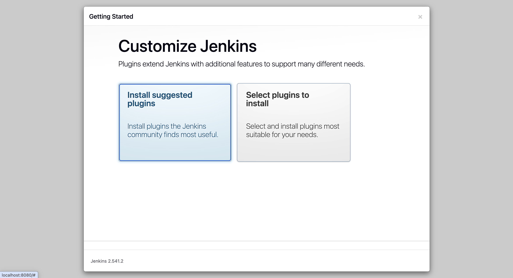

The installer now downloads and installs the plugins;

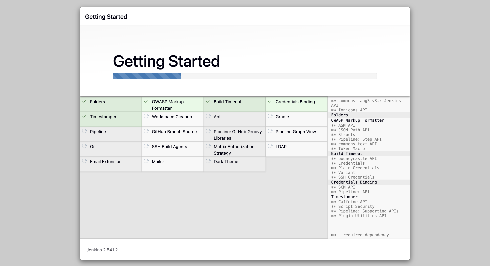

Create an admin user and Save and Continue.

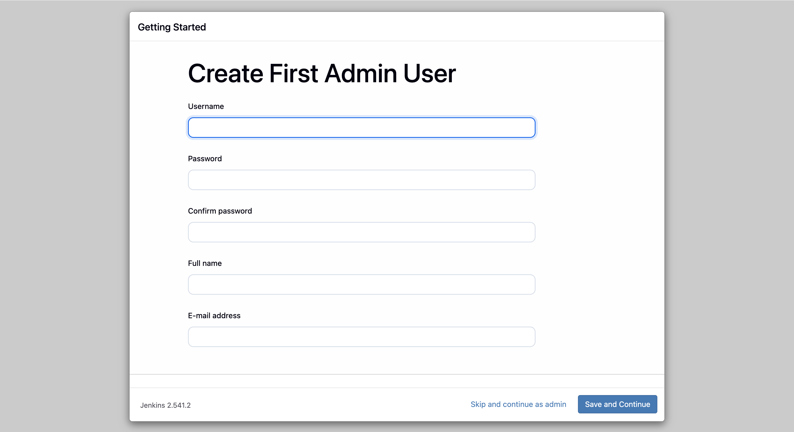

Next, setup the URL which users use to connect to Jenkins. If there are users joining remotely, it's better to create an A record(like jenkins.yourdomain.com) and set the Jenkins URL to 
**http://jenkins.yourdomain.com:8080.** Click save and finish.

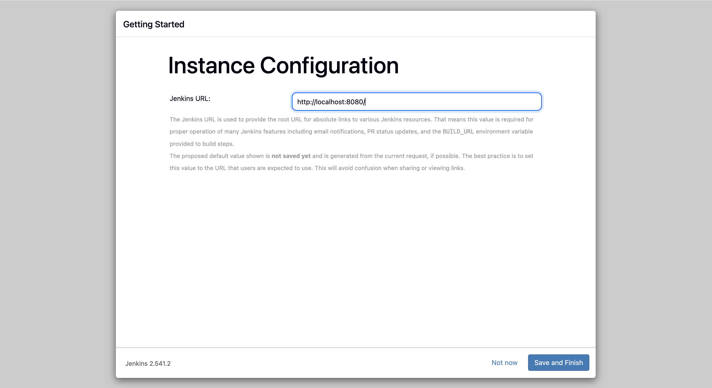 

Setup is complete. Click *Start using Jenkins.*

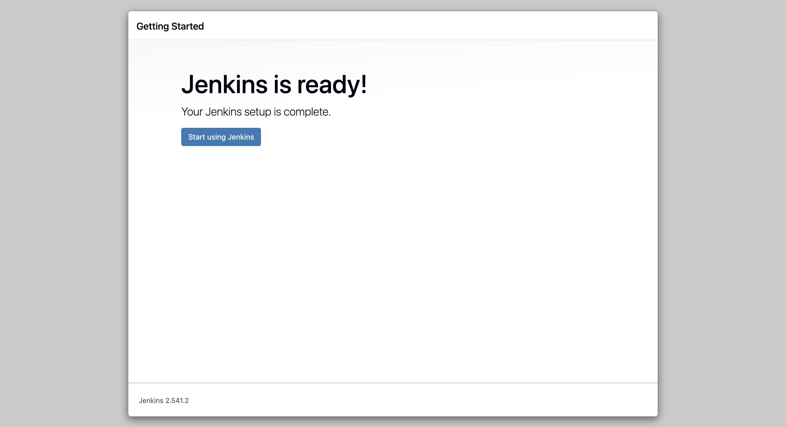 

You can now do other configurations such as creating jobs, managing Jenkins, installing new plugins and adding new users through Jenkins web interface.

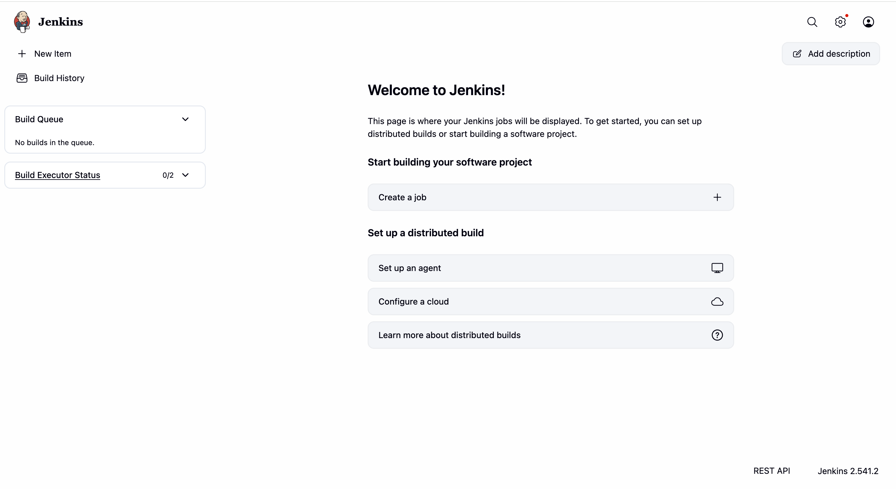 

To start Jenkins,

> brew services start jenkins-lts

To restart Jenkins,

> brew services restart jenkins-lts

Note:If you didn’t install the LTS version of Jenkins, don’t include the “-lts” portion of the above commands.

#### 4. Creating a new project

On the Jenkins dashboard, click on the "New item" option to create a new project.

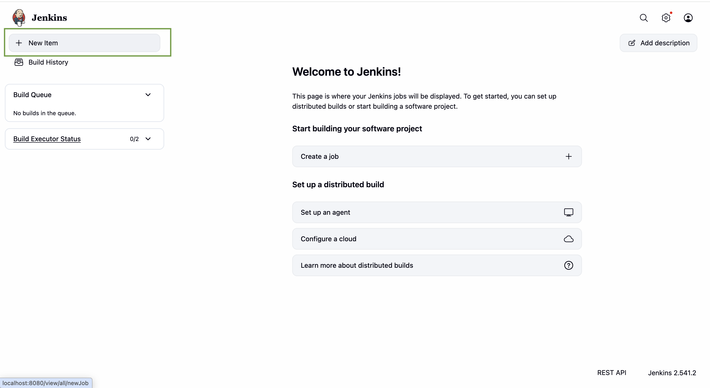 

#### 5. Configure the project type

Next, add a suitable name and select "Pipeline" option to proceed.

 

#### 6. Configure the General section

In the Pipeline configuration page, the "General" section looks like this;

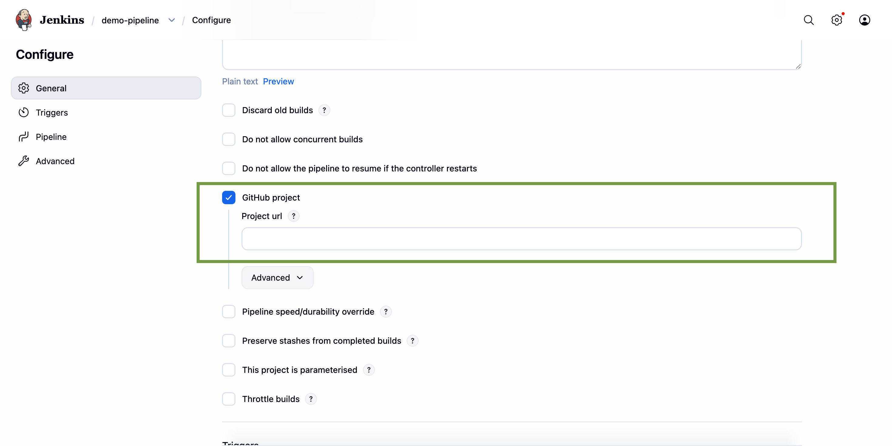 

Provide a description for the Pipeline, describing its purpose.

Establish the connection to the relevant repository where Jenkins can access the project to trigger the Pipeline.

#### 7. Configure the Triggers section

In the Triggers section you can specify the triggers when to start builds in the Pipeline.
For an example you can select "GitHub hook trigger for GITScm polling". It means Jenkins configures a job to build automatically and immediately when a change is pushed to the associated GitHub repository.

 

IMPORTANT: You have to have a github webhook created before configuring Triggers.

#### 8. Configure the Pipeline section

This is the most important part of the configuration process.
You need to mention the Jenkins file  that Jenkins will use to build and deploy your application.The Jenkins file contains all the stages and steps you will need for the CI/CD process.
Specify where Jenkins should retrieve the pipeline script(from the repository or from a file stored locally)

NOTE: Configure and provide the required credentials to receive the Jenkins file from the repository and to build the ssh connection to your instance.

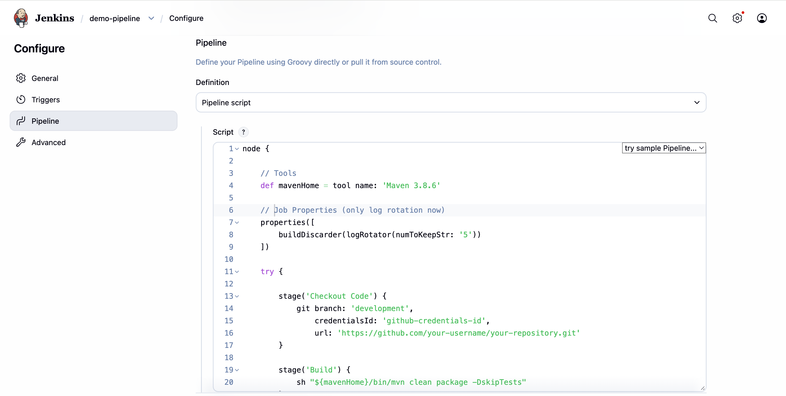

#### 9. Save the Pipeline and run it

Click save button and it will automatically redirect you to the Jenkin main dashboard. There you can click "Build Now" button to start building the Pipeline and the build history can be seen in the bottom left corner.

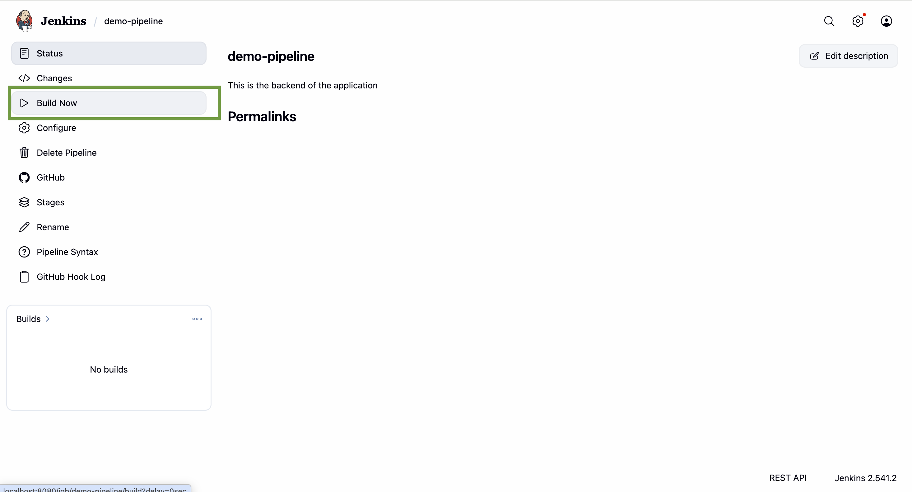

#### 10. Review the Build status

"Stages" button allows you to check the status of the application by Stage view.

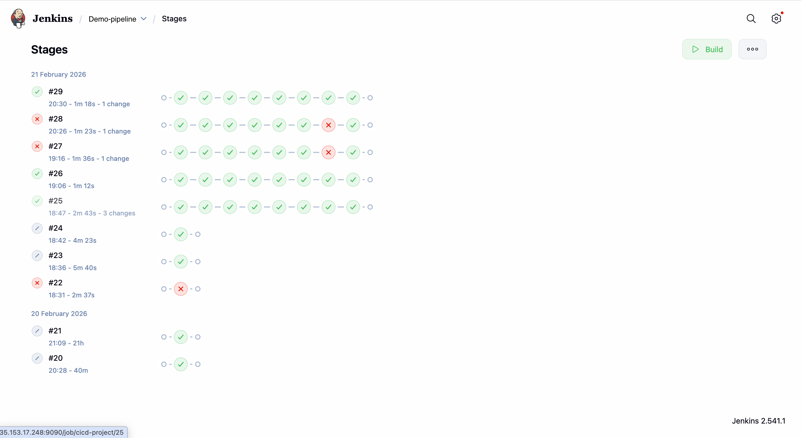

And, you can see a detailed view of output for each build through "Console Output".

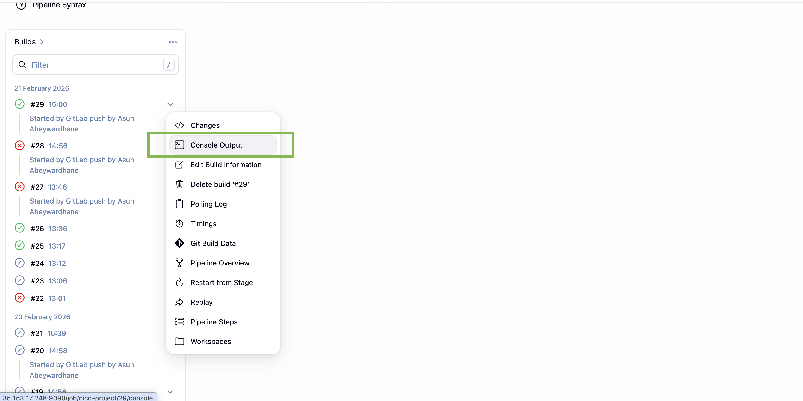

In the end of the console output, you can see the final status of the pipeline.
If the pipeline is built without any errors by passing all the stages, you can see the status as "Success". If any stage fails,the status can be seen as "Failure". You can debug using the logs displayed in the console. 

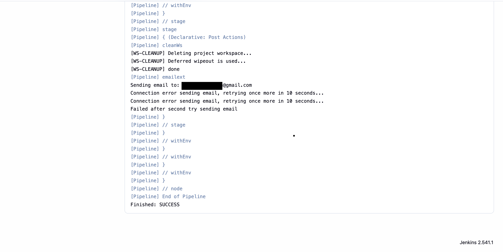

Here, we completed the creation of CI/CD pipeline using Jenkins to automate the process of building, testing and deploying of an application of your wish.

